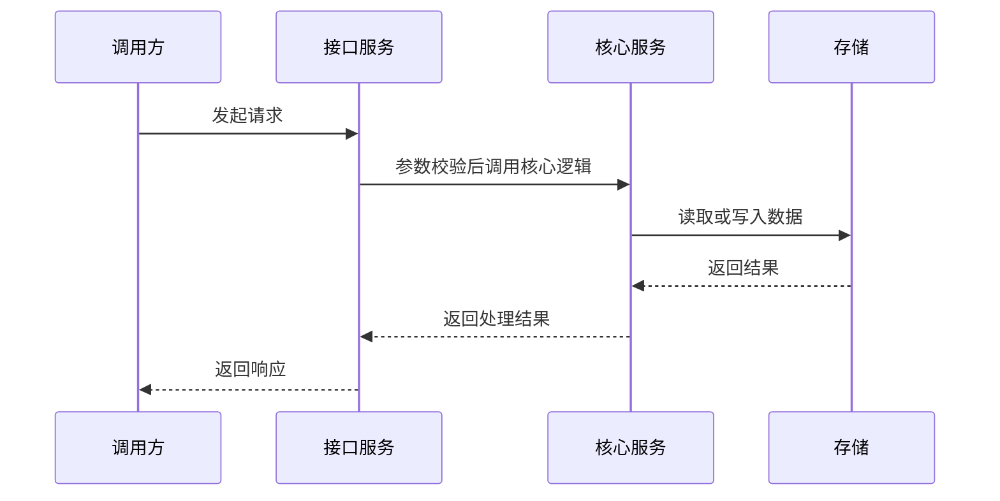
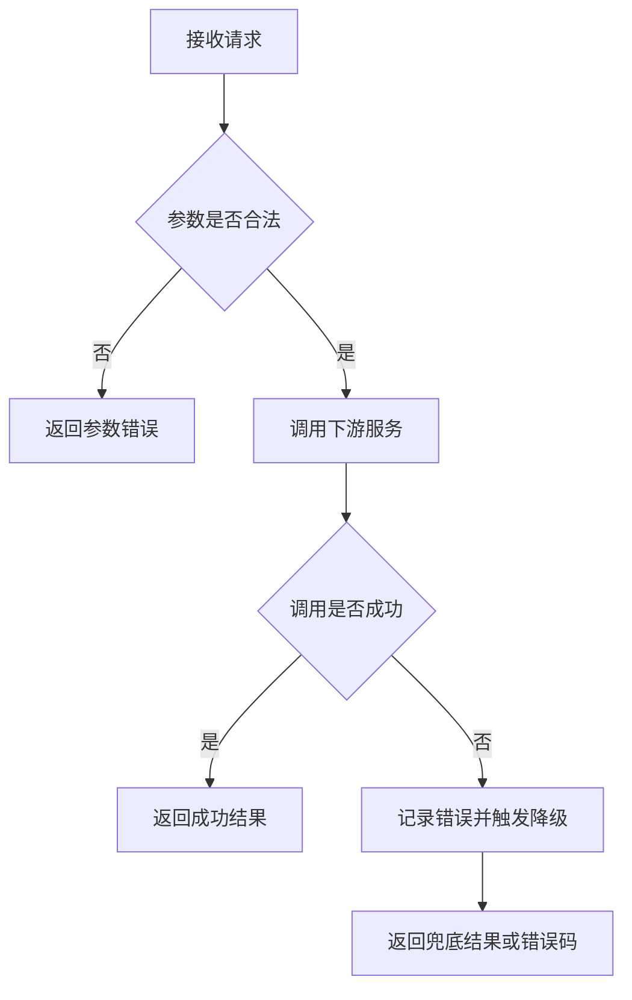

# Mermaid 调用逻辑图规则

当用户技术内容包含调用链、业务流程、模块交互、状态流转、异步任务、消息队列、回调、上下游依赖或上线切流逻辑时，必须在技术方案正文对应章节生成 Mermaid 图。

## 放置位置

优先放在以下章节：

- `2.1 方案选型与详细设计（架构、流程图等）`：系统模块交互、核心调用链、整体架构逻辑。
- `2.2 接口定义（重要）`：接口调用顺序、请求响应链路。
- `2.5 异常处理（必填）`：失败重试、降级、补偿、回滚流程。
- `2.11 新增调用链流量评估（必填）`：新增上下游调用链和流量路径。
- `7. 上线方案（必填）`：灰度、切流、回滚流程。

## 图类型选择

- 模块调用、接口请求、上下游交互：使用 `sequenceDiagram`。
- 业务分支、状态流转、异常处理：使用 `flowchart TD`。
- 状态机、审批流、任务状态变化：使用 `stateDiagram-v2`。
- 上线阶段、灰度推进、回滚步骤：使用 `flowchart LR` 或 `sequenceDiagram`。

## 生成规则

- 图只表达用户已提供或可低风险推断的事实，不编造系统、接口、队列、存储或依赖。
- 节点命名使用业务可读名称，必要时在括号中保留服务名或接口名。
- 复杂链路优先拆成 2 张小图，不生成难以阅读的巨图。
- Mermaid 图前写一句简短说明，图后写 2 到 4 条关键链路解释。
- 无法确定关键节点或调用方向时，不强行画图；在问题文档中记录“调用逻辑图缺失”及需补充信息。

## 示例：模块调用



## 示例：异常处理



## 问题文档记录

如果应该生成图但信息不足，在问题文档中加入：

```markdown
| ID | 来源 | 章节 | 严重程度 | 问题 | 原因 | 建议补充内容 | 是否阻塞 |
| --- | --- | --- | --- | --- | --- | --- | --- |
| DIAG-001 | 主 Agent | 2.1 方案选型与详细设计 | P2 中 | 缺少调用逻辑图 | 未提供核心调用方、被调方和调用顺序 | 补充调用入口、核心服务、下游依赖、同步/异步关系 | 否 |
```
