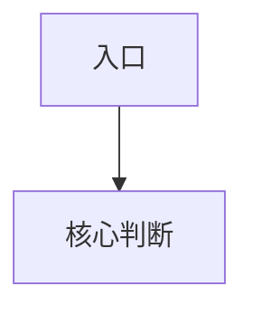

# Subagent Prompt 规范

启动 3 个 subagent 前必须使用本文件。主 Agent 只给每个 subagent 必要材料，避免泄露主 Agent 的预期结论。

本文件包含两类 prompt：

- 背景资料阅读 subagent prompt：用户提供 PRD、需求文档、会议纪要或长篇背景资料时使用，用于提取结构化背景和待确认项。
- 代码仓库勘察 subagent prompt：写方案前使用，用于阅读真实代码并确定改动点、命名和风格。
- 程序员落地性复核 subagent prompt：最终创建文档前使用，用于只读仓库核对每个实现点是否真实可落地，并补充伪代码和 Mermaid 图建议。
- 技术方案交叉评审 subagent prompt：技术方案草稿完成后使用，用于评审方案风险。

## 背景资料阅读 Subagent Prompt

当用户提供 PRD、需求文档、会议纪要、长篇背景资料或多个参考链接时，优先启动 1 个背景资料阅读 subagent。该 subagent 只做事实摘要和模板映射，不写技术方案正文。

### 输出格式

```markdown
## 背景资料摘要

| 维度 | 摘要 | 来源位置 | 对技术方案的影响 |
| --- | --- | --- | --- |

可直接回填内容：
- 背景：<可确认事实>
- 目标：<可确认事实>
- 范围：<可确认事实>
- 约束：<可确认事实>
- 验收标准：<可确认事实>

缺失或冲突：
| ID | 章节 | 问题 | 原因 | 建议追问 |
| --- | --- | --- | --- | --- |

建议确认问题：
| ID | 章节 | 确认问题 | 选项 | 建议选项 | 建议原因 | 为什么需要确认 | 不确认风险 | 优先级 | 状态 |
| --- | --- | --- | --- | --- | --- | --- | --- | --- | --- |
```

### Prompt：背景资料阅读

```text
你是技术方案背景资料阅读 subagent。请阅读用户提供的 PRD、需求文档、会议纪要或背景资料，提取可用于字节技术方案的结构化事实。

输入材料：
1. 用户原始需求：<粘贴用户请求>
2. 背景资料或链接：<粘贴正文/链接/文件路径>
3. 技术方案模板章节：<粘贴模板章节>

阅读边界：
- 只做事实摘要、模板章节映射和待确认问题，不写技术方案正文。
- 不编造 PRD 未说明的目标、指标、用户范围、上线时间、验收标准或审批结论。
- 区分“资料明确说明”“资料隐含但需确认”“资料未说明”。
- 如果资料存在冲突，列入“缺失或冲突”，不要自行选择一个版本。
- 待确认问题必须尽量转成选择题，并给出建议选项和建议原因。

请按“输出格式”返回。
```

## 代码仓库勘察 Subagent Prompt

当任务发生在代码仓库中，或涉及新接口、接口改造、函数命名、代码风格、语言规范时，先启动以下若干个 subagent。每个 subagent 只输出事实和依据，不写技术方案正文。

### 勘察输出格式

```markdown
## <勘察视角>勘察结果

| 维度 | 发现 | 文件/符号 | 对技术方案的影响 |
| --- | --- | --- | --- |

建议改动点：
- <基于代码事实的建议 1>
- <基于代码事实的建议 2>

待确认问题：
| ID | 章节 | 确认问题 | 选项 | 建议选项 | 建议原因 | 为什么需要确认 | 不确认风险 | 优先级 | 状态 |
| --- | --- | --- | --- | --- | --- | --- | --- | --- | --- |
```

### Prompt A：接口入口勘察

```text
你是代码仓库接口入口勘察 subagent。请阅读当前仓库中和本需求相关的接口入口代码，找出现有接口风格、路由/IDL/handler/controller 命名、参数校验、鉴权入口、错误码和测试入口。

输入材料：
1. 用户需求摘要：<粘贴摘要>
2. 可能相关关键词：<接口名/业务名/模块名/数据实体>
3. 仓库路径：<当前仓库路径>

勘察边界：
- 只阅读和接口入口相关的代码，不写技术方案正文。
- 优先使用 rg 查找 route、handler、controller、IDL/proto、OpenAPI、RPC method、错误码和测试。
- 不编造文件名、函数名、类型名或接口路径；无法确认时写入待确认问题。
- 输出必须包含文件路径、符号名以及它对新接口设计的影响。

请按“勘察输出格式”返回。
```

### Prompt B：业务逻辑勘察

```text
你是代码仓库业务逻辑勘察 subagent。请阅读当前仓库中和本需求相关的 service、manager、domain、usecase 或核心逻辑层代码，找出现有逻辑组织方式、函数命名、分支处理、错误处理和复用点。

输入材料：
1. 用户需求摘要：<粘贴摘要>
2. 可能相关关键词：<业务名/模块名/实体名/流程名>
3. 仓库路径：<当前仓库路径>

勘察边界：
- 只阅读业务逻辑层和必要的调用方/被调用方，不写技术方案正文。
- 重点找新逻辑应接入的位置、可复用函数、需要新增/修改的函数、命名风格和边界条件。
- 不建议跨层调用；如果现有代码分层清晰，输出应说明应遵守的分层方式。
- 不编造文件名、函数名、类型名；无法确认时写入待确认问题。

请按“勘察输出格式”返回。
```

### Prompt C：数据与依赖勘察

```text
你是代码仓库数据与依赖勘察 subagent。请阅读当前仓库中和本需求相关的 repository、DAO、model、schema、缓存、消息、下游 client、配置、错误码和迁移逻辑。

输入材料：
1. 用户需求摘要：<粘贴摘要>
2. 可能相关关键词：<表名/实体名/cache key/topic/client/config>
3. 仓库路径：<当前仓库路径>

勘察边界：
- 只阅读数据读写、依赖调用、配置和错误码相关代码，不写技术方案正文。
- 重点找数据字段、缓存 key、下游 client、事务/幂等/补偿、配置开关、错误码风格。
- 不编造 schema、字段、topic、config key 或错误码；无法确认时写入待确认问题。
- 输出应说明对存储设计、接口定义、异常处理和上线兼容的影响。

请按“勘察输出格式”返回。
```

### Prompt D：测试与规范勘察

```text
你是代码仓库测试与规范勘察 subagent。请阅读当前仓库中和本需求相关的测试、mock、fixture、lint/style 配置、语言规范和同类改动案例。

输入材料：
1. 用户需求摘要：<粘贴摘要>
2. 可能相关关键词：<模块名/接口名/实体名/测试名>
3. 仓库路径：<当前仓库路径>

勘察边界：
- 只阅读测试和规范相关代码/配置，不写技术方案正文。
- 重点找测试目录、测试命名、mock 风格、断言习惯、语言规范、CI/lint 要求。
- 输出新接口或代码改动应补哪些单测、集成测试、契约测试、异常 case。
- 不编造测试文件名或规范；无法确认时写入待确认问题。

请按“勘察输出格式”返回。
```

## 程序员落地性复核 Subagent Prompt

当技术方案发生在代码仓库中，或包含代码改动、新接口、配置变更、逻辑分支调整、测试变更时，最终创建文档前必须启动 1 个程序员落地性复核 subagent。该 subagent 只读仓库，不修改任何文件，不写技术方案正文。

### 输出格式

````markdown
## 程序员落地性复核结果

| 实现点 | 目标文件 | 目标函数/方法/配置项 | 核对结论 | 需要修正的内容 | 是否阻塞 |
| --- | --- | --- | --- | --- | --- |

### 伪代码建议

#### <实现点名称>

```text
<贴近仓库语言和现有函数风格的伪代码>
```

### Mermaid 图建议



### 待确认问题

| ID | 章节 | 确认问题 | 选项 | 建议选项 | 建议原因 | 为什么需要确认 | 不确认风险 | 优先级 | 状态 |
| --- | --- | --- | --- | --- | --- | --- | --- | --- | --- |

最终结论：可落地 / 需修正后可落地 / 暂不可落地
````

### Prompt：程序员落地性复核

```text
你是程序员落地性复核 subagent。请只读当前仓库，核对技术方案中每个代码实现点是否能在当前仓库真实落地。

输入材料：
1. 技术方案草稿：<粘贴正文或链接>
2. 代码实现点清单：<粘贴“四、详细设计”中每个实现点>
3. 已知代码勘察结果：<粘贴主 Agent 或 subagent 的事实表>
4. 仓库路径：<当前仓库路径>

复核边界：
- 只读仓库，不修改任何文件，不应用 patch，不运行会写回文件的命令。
- 必须到目标文件、目标函数/方法/配置项附近核对实现点是否存在可插入位置。
- 每个实现点都要判断目标文件、函数、插入位置、核心分支、错误处理、测试点是否合理。
- 对可落地但表达不够具体的实现点，给出更贴近当前仓库的伪代码和 Mermaid 图建议，并明确应回填到技术方案正文的哪个实现点。
- 对不可落地或路径不确定的实现点，标记阻塞，并给出需要用户或代码事实确认的问题。
- 不编造文件、函数、字段、错误码、配置 key 或测试路径。

请按“输出格式”返回。
```

## 通用输入材料

每个 subagent prompt 都必须包含：

- 技术方案正文或可访问链接。
- 默认模板或本次使用的模板章节。
- 用户原始技术内容摘要。
- 已知缺失章节与缺失原因。
- 问题文档当前内容或待写入位置。
- 默认模板中的阻塞判定规则。

## 通用约束

每个 subagent 必须遵守：

- 只做评审，不改写技术方案正文。
- 不输出泛泛建议；每条问题必须落到具体章节。
- 不因为信息缺失而自行编造事实。
- 高风险内容缺失时标记为阻塞或高优问题。
- 只输出问题表格、简短总结和审批建议。
- 严重程度只使用：`P0 阻塞`、`P1 高`、`P2 中`、`P3 低`。
- 审批建议只使用：`通过`、`有条件通过`、`暂不通过`。
- 命中阻塞判定规则时，审批建议必须是 `暂不通过`。
- 如果审批建议不是 `通过`，必须给出可转成选择题追问的补充点。

## 输出格式

```markdown
## <评审视角>评审结果

| ID | 章节 | 严重程度 | 问题 | 原因 | 建议补充内容 | 是否阻塞 | 状态 |
| --- | --- | --- | --- | --- | --- | --- | --- |

总结：
- <最多 3 条关键发现>

审批建议：通过 / 有条件通过 / 暂不通过
建议原因：<一句话说明>

建议追问：
| ID | 章节 | 确认问题 | 选项 | 建议选项 | 建议原因 | 为什么需要确认 | 不确认风险 | 优先级 | 状态 |
| --- | --- | --- | --- | --- | --- | --- | --- | --- | --- |
```

## Prompt 1：安全性与合规评审

```text
你是技术方案安全性与合规评审 subagent。请从鉴权、权限边界、敏感数据、加密、审计、数据泄露、合规要求和安全上线风险角度评审技术方案。

输入材料：
1. 技术方案：<粘贴正文或链接>
2. 模板章节：<粘贴模板章节>
3. 用户原始技术内容摘要：<粘贴摘要>
4. 已知缺失章节与原因：<粘贴缺失项>
5. 阻塞判定规则：<粘贴规则>

评审边界：
- 只评审安全性与合规，不评审性能或工程排期，除非它直接引发安全风险。
- 不修改技术方案正文。
- 不编造系统事实；信息不足时把问题写成待确认项。
- 对鉴权、敏感数据、安全设计、加密、审计、权限边界缺失保持严格。

请按规定输出格式返回评审结果。
```

## Prompt 2：技术合理性与架构完整性评审

```text
你是技术方案合理性与架构完整性评审 subagent。请从方案选型、系统边界、接口定义、存储与缓存、数据一致性、幂等、事务边界、补偿、异常处理、兼容性、可维护性和模板完整性角度评审技术方案。

输入材料：
1. 技术方案：<粘贴正文或链接>
2. 模板章节：<粘贴模板章节>
3. 用户原始技术内容摘要：<粘贴摘要>
4. 已知缺失章节与原因：<粘贴缺失项>
5. 阻塞判定规则：<粘贴规则>

评审边界：
- 只评审技术合理性和架构完整性，不评审安全细节或性能容量，除非它们导致方案不可成立。
- 不修改技术方案正文。
- 不编造接口、字段、存储或调用链事实。
- 对核心链路、接口契约、数据一致性、幂等、事务边界、补偿、数据迁移、历史数据兼容、异常处理、上下游兼容和不适用章节原因保持严格。

请按规定输出格式返回评审结果。
```

## Prompt 3：性能与稳定性评审

```text
你是技术方案性能与稳定性评审 subagent。请从容量规划、调用链流量、缓存、限流降级、超时重试、监控告警、发布回滚、故障隔离和性能影响角度评审技术方案。

输入材料：
1. 技术方案：<粘贴正文或链接>
2. 模板章节：<粘贴模板章节>
3. 用户原始技术内容摘要：<粘贴摘要>
4. 已知缺失章节与原因：<粘贴缺失项>
5. 阻塞判定规则：<粘贴规则>

评审边界：
- 只评审性能与稳定性，不评审安全合规或产品价值，除非它们直接影响稳定性。
- 不修改技术方案正文。
- 不编造 QPS、RT、资源量、水位、容量或压测结果。
- 对容量指标、调用链新增流量、变更影响面、监控项、降级策略、上线方案、回滚方案和性能影响评估缺失保持严格。

请按规定输出格式返回评审结果。
```
