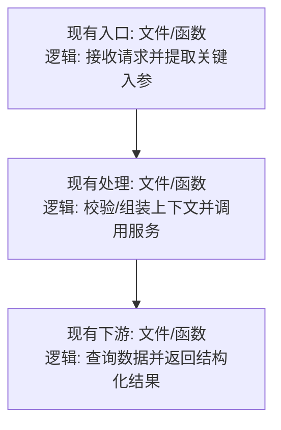
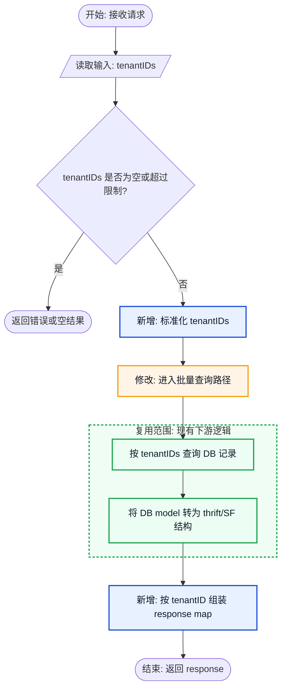

# 技术实现流程规划

## 目标

在真正改代码前，把技术方案中的具体实现落到仓库现有代码结构上，输出可评审的实现流程、详细调用图、预期变更图、图片版可视化图和最小改动方案。该 skill 只在用户两次确认后才进入代码落库：先确认实现思路，再确认开发 Plan。

## 工作流

1. 读取用户提供的技术方案，提取本次需求目标、约束、预期行为、涉及模块和待实现点。
2. 如果用户没有给出明确方案文件或代码仓库位置，先用已有上下文和 `rg --files` 查找可能相关的方案文档；仍无法定位时，只询问必要的文件路径或关键词。
3. 读取仓库相关代码，优先用 `rg` 定位入口、调用链、类型定义、配置、已有相似实现和测试，不依赖猜测。
4. 对齐仓库现有风格，包括目录归属、命名方式、错误处理、日志、测试组织和已有辅助函数。
5. 基于实际代码证据生成现有调用图，并基于准备采用的最小改动方案生成预期变更图。
6. 基于 Mermaid 源图和代码证据调用生图能力，生成图片版可视化图。
7. 输出实现流程评审稿，不修改、创建、删除任何仓库文件。
8. 等待用户明确确认实现思路。用户没有确认前，不进入开发计划，也不落库。
9. 用户确认实现思路后，进入当前产品支持的 Plan 模式来总结开发计划；如果运行环境无法切换 Plan 模式，则输出等价的“开发 Plan”并明确等待确认。
10. 开发 Plan 必须说明修改文件、修改目的、实施顺序、验证方式和风险控制。
11. 等待用户明确确认开发 Plan。用户没有确认 Plan 前，不修改仓库文件。
12. 用户确认开发 Plan 后，才允许按计划进入代码实现；实现时继续遵守最小改动原则。

## 实现流程评审稿

首次输出必须包含这些部分：

````markdown
**需求理解**
- <从技术方案中提取的目标和约束>

**相关代码定位**
- `<文件路径>`：<与需求相关的现有职责或调用点>

**现有逻辑链路**
- <按当前代码说明请求、数据、状态或控制流如何流转>

**拟实现流程**
1. <步骤 1>
2. <步骤 2>
3. <步骤 3>

**现有调用图**


**预期变更图**


**图片版可视化图**
- <插入或链接基于关键逻辑代码块、Mermaid 和代码证据生成的图片>

**关键逻辑代码块**

```pseudo
// 节点 B: 新增/修改的关键逻辑
input := <关键入参>
if <校验条件不满足> {
    return <错误或空结果>
}
result := callExistingOrNewLogic(input)
output := buildResponse(result)
return output
```

```pseudo
// 复用范围 R: 现有逻辑内部流程
records := queryByIDs(ids)
for record in records {
    converted := convert(record)
    result[record.ID] = converted
}
return result
```

**最小改动清单**
- `<文件路径>`：<计划如何最小范围修改，为什么放在这里>

**风险和待确认**
- <可能影响原有逻辑、兼容性、测试或边界行为的问题>

当前阶段只读分析，不会落库。请确认是否按这个实现思路进入开发 Plan。
````

## 图生成规则

- 调用图必须来自仓库实际代码，不要凭技术方案臆造调用关系。
- 调用图节点必须同时包含代码位置和具体逻辑动作，优先使用 `文件路径:函数/类型/方法 + 逻辑: <该节点实际做什么>`；如果语言或框架没有显式函数边界，标注模块、路由、配置项或组件名。
- 节点内容禁止只写文件名、函数名、类名或接口名；必须说明该节点处理了什么输入、执行了什么判断/转换/查询/组装、产出了什么结果。
- 调用图边必须表达真实调用、数据传递、事件触发、配置读取或依赖关系；不确定的边不要放入图片，改在文字说明中补充。
- 实现流程评审稿必须在图后输出“关键逻辑代码块”，用 fenced code block 展开关键节点的流程；代码块可以是真实代码摘录、接近仓库语言的伪代码，或结构化 pseudo code。
- 关键逻辑代码块必须展示控制流顺序，包括输入读取、校验条件、循环/批处理、查询或 RPC 调用、结构转换、map/list 构造、返回值组装和错误/空结果分支中的关键部分。
- 代码块要和图中节点一一对应，使用节点编号、节点名或文件路径标识来源；不要只写自然语言段落解释逻辑。
- 预期变更图只表达预期发生的代码变更和受影响链路，必须清晰区分“新增”“修改”“删除/废弃”和现有逻辑范围。
- 新增、修改和复用范围必须使用不同颜色的框清晰标识；颜色不能替代文字标签，必须同时保留 `新增:`、`修改:`、`删除/废弃:` 或 `复用范围:`。
- 默认颜色语义：新增使用蓝色边框，修改使用橙色边框，复用范围使用绿色外框，删除/废弃使用红色或灰色边框。
- 尽量避免在单个节点里使用“复用”作为替代说明；如果涉及现有逻辑继续使用，必须展开该现有逻辑内部的关键调用步骤，再用外框或分组标注为“复用范围”。
- 复用范围的内部节点仍要写真实代码逻辑，例如 `cache/client.go:GetTenant`、`converter/user.go:ToDTO`，不要只写 `复用: cache client` 这种黑盒节点。
- 新增或修改点必须在节点文本中显式标注，例如 `新增: XxxHandler`、`修改: service/foo.go:BuildRequest`、`删除/废弃: oldFallback`。
- 新增或修改节点必须说明具体实现逻辑，例如参数校验规则、批量拆分规则、数据结构转换、map/list 构造、过滤条件、返回值组装或异常处理分支。
- 预期变更图必须是标准逻辑流程图，不是模块关系图或调用点排列图。优先使用开始/结束节点、处理节点、输入输出节点、判断菱形、分支边和汇合点表达控制流。
- 代码里存在 `if`、`switch`、空值判断、开关判断、错误分支、循环或 fallback 时，图中必须出现对应判断节点或循环节点；分支边必须标注 `是/否`、`true/false`、`命中/未命中` 等明确条件。
- 图中逻辑说明必须具体到可执行判断或动作，例如 `tenantIDs 为空?`、`len(tenantIDs) > 50?`、`meta == nil?`、`enable == false?`、`遍历 records 构造 map`；避免只写“读取配置”“预处理”“处理逻辑”“完成绑定”等模糊词。
- 图片和 Mermaid 图中不展示风险点、待确认点或测试点；这些内容如有需要，放在技术方案、文字说明或开发 Plan 中。
- 图较复杂时，先输出总览图，再按模块输出 1 到 3 张局部图，不要把所有节点塞进一张不可读的大图。
- 必须输出 Mermaid 源图，保证调用关系可审阅、可复制、可渲染。
- 必须基于关键逻辑代码块、Mermaid 和代码证据调用生图能力生成图片版可视化图；图片的主源是代码逻辑，Mermaid 只提供结构和布局，不得本末倒置。
- 图片不是装饰图、摘要图或仅对 Mermaid 做美化；图片必须优先表达代码如何执行，包括输入如何进入、条件如何判断、调用如何发生、数据如何转换、结果如何组装并返回。
- 图片必须从开发实现视角展示接口改动后的最终执行逻辑，而不是展示代码位置清单、函数签名清单或模块关系清单。
- 图片重点必须聚焦代码逻辑链路：每个节点的逻辑动作、关键执行流程、调用边、模块分组、数据或控制流方向、预期变更标注，以及展开后的现有逻辑范围。
- 图片版必须沿用 Mermaid 的颜色语义，确保新增、修改、复用范围在视觉上明显区分。
- 图片必须使用直观的标准竖形逻辑流程图：主控制流从上到下排列，入口在顶部，判断和处理在中部，下游依赖、转换、写入或返回在底部。
- 分支、复用依赖或辅助调用可以挂在主链路左右两侧，但不能把主流程改成横向泳道图。
- 禁止生成横向大画布流程图、左右铺开的泳道图、横向时间线图、复杂回折箭头图或以大面积分区框为主体的图。
- 禁止只画一串圆角矩形；存在条件判断时必须使用明显的菱形判断节点和带条件标签的分支箭头。
- 图片应尽量保持 Mermaid 的节点语义，只增强垂直层次、分组、颜色、线型和可读性，不重新发明架构、不添加装饰性业务元素。
- 生图提示词必须以关键逻辑代码块为主要依据，先理解代码中的真实执行链路，再从开发实现视角把“接口改动后的最终执行逻辑”转译成图片中的简洁逻辑动作标签；图片中尽量避免出现代码片段、函数签名、长文件路径或伪代码，只在必要时保留短文件名或关键方法名作为辅助定位；必须忠实呈现 Mermaid 中的调用节点、边、分组、颜色语义和预期变更标注，并明确要求标准竖形逻辑流程图；遇到条件判断必须使用菱形节点和带条件标签的分支箭头；如果存在复用范围，必须画出范围内的关键调用步骤并用绿色外框标注，不要画成单个“复用”黑盒节点；不添加代码中不存在的模块、流程、风险、待确认项或测试项。

## 开发 Plan

用户确认实现思路后，必须先制定开发 Plan，再等待第二次确认。Plan 至少包含：

- 修改文件清单：列出预计修改或新增的文件。
- 修改目的：说明每个文件为什么需要改，避免范围扩张。
- 实施顺序：按依赖关系排列开发步骤。
- 验证方式：列出计划运行的单测、集成测试、静态检查或手动验证。
- 风险控制：说明兼容性、回滚、开关、异常分支或未知点。

Plan 输出结尾必须明确写：

```markdown
请确认是否按以上开发 Plan 开始落库实现。确认前我不会修改仓库文件。
```

## 最小改动原则

- 优先复用现有模块、函数、类型、配置和测试工具。
- 代码落点必须贴近现有职责边界；不要为了新需求创建孤立的新目录或横向工具层。
- 命名、错误处理、日志、注释、测试风格以仓库现有风格为准。
- 不顺手重构无关逻辑，不改格式无关文件，不扩大修改范围。
- 新增抽象只在它能减少明确重复、隔离真实复杂度或匹配仓库已有模式时使用。
- 如果实现过程中发现必须改动 Plan 外文件，先说明原因并等待用户确认。

## 禁止事项

在用户确认实现思路前，禁止：

- 修改、创建、删除仓库文件。
- 使用 `apply_patch` 或任何会写入文件的命令。
- 运行会自动格式化、生成代码、更新锁文件或产生仓库变更的命令。
- 提交、暂存、推送代码。
- 输出完整落库实现。

在用户确认开发 Plan 前，禁止：

- 开始代码实现。
- 改动未列入 Plan 的文件。
- 扩大需求范围或引入无关重构。

## 质量检查

交付实现流程评审稿前确认：

- 已读取技术方案或说明无法定位方案的原因。
- 已读取仓库相关代码并给出具体文件路径。
- 已输出现有调用图和预期变更图。
- 已生成图片版可视化图。
- 图中节点不是调用点清单；每个关键节点都包含代码位置和具体逻辑动作。
- 已输出关键逻辑代码块，且代码块能说明流程如何从输入、校验、调用、转换走到返回。
- 预期变更图符合标准逻辑流程图形态：有开始/结束、处理、判断、分支和汇合；存在条件逻辑时没有被压平成普通矩形节点。
- Mermaid 图能表达现有链路、拟新增链路和修改点，且新增/修改/删除标注清晰；新增、修改和复用范围使用不同颜色的框；涉及复用现有逻辑时，已展开内部流程并用外框标注复用范围。
- 最小改动清单解释了每个落点的原因。
- 没有修改任何仓库文件。
- 结尾明确等待用户确认实现思路。

交付开发 Plan 前确认：

- 用户已经明确确认实现思路。
- Plan 能直接指导下一阶段实现。
- Plan 包含修改文件、实施顺序、验证方式和风险控制。
- 结尾明确等待用户确认开发 Plan。
