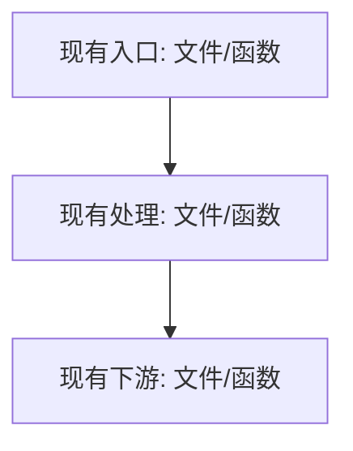
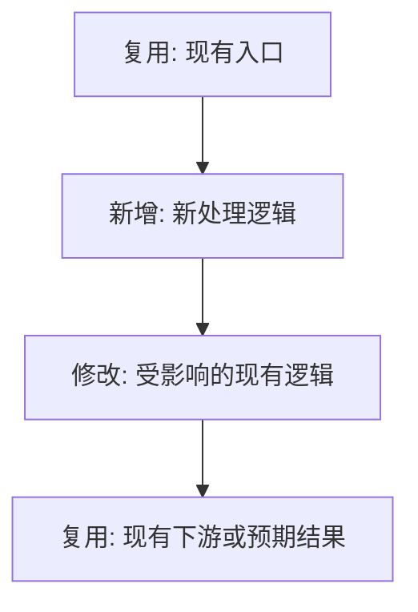

# 技术实现流程规划

## 目标

在真正改代码前，把技术方案中的具体实现落到仓库现有代码结构上，输出可评审的实现流程、详细调用图、预期变更图、图片版可视化图和最小改动方案。该 skill 只在用户两次确认后才进入代码落库：先确认实现思路，再确认开发 Plan。

## 工作流

1. 读取用户提供的技术方案，提取本次需求目标、约束、预期行为、涉及模块和待实现点。
2. 如果用户没有给出明确方案文件或代码仓库位置，先用已有上下文和 `rg --files` 查找可能相关的方案文档；仍无法定位时，只询问必要的文件路径或关键词。
3. 读取仓库相关代码，优先用 `rg` 定位入口、调用链、类型定义、配置、已有相似实现和测试，不依赖猜测。
4. 对齐仓库现有风格，包括目录归属、命名方式、错误处理、日志、测试组织和已有辅助函数。
5. 基于实际代码证据生成现有调用图，并基于准备采用的最小改动方案生成预期变更图。
6. 基于 Mermaid 源图和代码证据调用生图能力，生成图片版可视化图。
7. 输出实现流程评审稿，不修改、创建、删除任何仓库文件。
8. 等待用户明确确认实现思路。用户没有确认前，不进入开发计划，也不落库。
9. 用户确认实现思路后，进入当前产品支持的 Plan 模式来总结开发计划；如果运行环境无法切换 Plan 模式，则输出等价的“开发 Plan”并明确等待确认。
10. 开发 Plan 必须说明修改文件、修改目的、实施顺序、验证方式和风险控制。
11. 等待用户明确确认开发 Plan。用户没有确认 Plan 前，不修改仓库文件。
12. 用户确认开发 Plan 后，才允许按计划进入代码实现；实现时继续遵守最小改动原则。

## 实现流程评审稿

首次输出必须包含这些部分：

````markdown
**需求理解**
- <从技术方案中提取的目标和约束>

**相关代码定位**
- `<文件路径>`：<与需求相关的现有职责或调用点>

**现有逻辑链路**
- <按当前代码说明请求、数据、状态或控制流如何流转>

**拟实现流程**
1. <步骤 1>
2. <步骤 2>
3. <步骤 3>

**现有调用图**


**预期变更图**


**图片版可视化图**
- <插入或链接基于以上 Mermaid 和代码证据生成的图片>

**最小改动清单**
- `<文件路径>`：<计划如何最小范围修改，为什么放在这里>

**风险和待确认**
- <可能影响原有逻辑、兼容性、测试或边界行为的问题>

当前阶段只读分析，不会落库。请确认是否按这个实现思路进入开发 Plan。
````

## 图生成规则

- 调用图必须来自仓库实际代码，不要凭技术方案臆造调用关系。
- 调用图节点优先标注 `文件路径:函数/类型/方法`；如果语言或框架没有显式函数边界，标注模块、路由、配置项或组件名。
- 调用图边必须表达真实调用、数据传递、事件触发、配置读取或依赖关系；不确定的边不要放入图片，改在文字说明中补充。
- 预期变更图只表达预期发生的代码变更和受影响链路，必须清晰区分“新增”“修改”“复用”“删除/废弃”。
- 新增或修改点必须在节点文本中显式标注，例如 `新增: XxxHandler`、`修改: service/foo.go:BuildRequest`、`复用: cache/client.go:Get`。
- 图片和 Mermaid 图中不展示风险点、待确认点或测试点；这些内容如有需要，放在技术方案、文字说明或开发 Plan 中。
- 图较复杂时，先输出总览图，再按模块输出 1 到 3 张局部图，不要把所有节点塞进一张不可读的大图。
- 必须输出 Mermaid 源图，保证调用关系可审阅、可复制、可渲染。
- 必须基于 Mermaid 和代码证据调用生图能力生成图片版可视化图；图片只作为 Mermaid 内容的视觉增强，不能替代 Mermaid 源图、文件路径和代码证据。
- 图片重点必须聚焦代码逻辑：调用节点、调用边、模块分组、数据或控制流方向，以及预期变更标注。
- 图片应尽量保持 Mermaid 的拓扑结构和节点语义，只增强层次、分组、颜色、线型和可读性，不重新发明架构、不添加装饰性业务元素。
- 生图提示词必须要求画面忠实呈现 Mermaid 中的调用节点、边、分组和预期变更标注，不添加代码中不存在的模块、流程、风险、待确认项或测试项。

## 开发 Plan

用户确认实现思路后，必须先制定开发 Plan，再等待第二次确认。Plan 至少包含：

- 修改文件清单：列出预计修改或新增的文件。
- 修改目的：说明每个文件为什么需要改，避免范围扩张。
- 实施顺序：按依赖关系排列开发步骤。
- 验证方式：列出计划运行的单测、集成测试、静态检查或手动验证。
- 风险控制：说明兼容性、回滚、开关、异常分支或未知点。

Plan 输出结尾必须明确写：

```markdown
请确认是否按以上开发 Plan 开始落库实现。确认前我不会修改仓库文件。
```

## 最小改动原则

- 优先复用现有模块、函数、类型、配置和测试工具。
- 代码落点必须贴近现有职责边界；不要为了新需求创建孤立的新目录或横向工具层。
- 命名、错误处理、日志、注释、测试风格以仓库现有风格为准。
- 不顺手重构无关逻辑，不改格式无关文件，不扩大修改范围。
- 新增抽象只在它能减少明确重复、隔离真实复杂度或匹配仓库已有模式时使用。
- 如果实现过程中发现必须改动 Plan 外文件，先说明原因并等待用户确认。

## 禁止事项

在用户确认实现思路前，禁止：

- 修改、创建、删除仓库文件。
- 使用 `apply_patch` 或任何会写入文件的命令。
- 运行会自动格式化、生成代码、更新锁文件或产生仓库变更的命令。
- 提交、暂存、推送代码。
- 输出完整落库实现。

在用户确认开发 Plan 前，禁止：

- 开始代码实现。
- 改动未列入 Plan 的文件。
- 扩大需求范围或引入无关重构。

## 质量检查

交付实现流程评审稿前确认：

- 已读取技术方案或说明无法定位方案的原因。
- 已读取仓库相关代码并给出具体文件路径。
- 已输出现有调用图和预期变更图。
- 已生成图片版可视化图。
- Mermaid 图能表达现有链路、拟新增链路和修改点，且新增/修改/复用标注清晰。
- 最小改动清单解释了每个落点的原因。
- 没有修改任何仓库文件。
- 结尾明确等待用户确认实现思路。

交付开发 Plan 前确认：

- 用户已经明确确认实现思路。
- Plan 能直接指导下一阶段实现。
- Plan 包含修改文件、实施顺序、验证方式和风险控制。
- 结尾明确等待用户确认开发 Plan。
